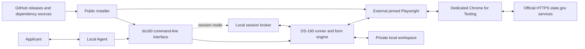

# Runtime Architecture and Data Flow

This document explains how the installed DS-160 B1/B2 Skill operates, where its
processes run, and how applicant data moves between the local workspace and official
services. It is intended for users and Agents deciding whether to install or run the
tool.

## System overview



There is no project-operated cloud service in the application-data path.

## Runtime components

| Component | Location | Responsibility |
| --- | --- | --- |
| Agent | User's computer | Reads the installed `SKILL.md`, gathers applicant facts, invokes commands, and presents human checkpoints. |
| `ds160` CLI | Installed Skill directory | Validates command arguments and exposes profile, doctor, run, diagnostics, and session commands. |
| Session broker | User's computer, loopback only | Lets one-shot Agent command tools communicate with a persistent runner. It binds to `127.0.0.1` on a random port and requires a random per-session token. |
| Runner and form engine | Local `ds160` process | Validates the profile, applies the B1/B2 page rules, manages recovery and Review, and enforces human authorization boundaries. |
| Playwright | Separate local driver directory | Connects the runner to the browser using loopback Chrome DevTools Protocol (CDP). The installer pins the supported Playwright version. |
| Chrome for Testing | Local Playwright browser cache | Displays and operates the official DS-160 website in a dedicated browser profile. It is separate from the user's normal browser profile. |
| Workspace | Private local directory | Holds profiles, photos, browser state, logs, diagnostics, and saved documents created during use. |
| CEAC and photo service | Official HTTPS hosts in the `state.gov` namespace | Receive the application values and photo that the applicant chooses to enter. |

## Command modes

The form engine is the same in both modes.

- **Persistent `run` mode:** the Agent keeps one local process alive and writes
  replies to its standard input. This is the simplest path when the Agent exposes
  a writable long-running terminal session.
- **Session mode:** short-lived `session wait` and `session reply` commands talk
  to the local broker, which owns the persistent runner. Events are ordered by a
  monotonic sequence number. The broker is not exposed to the LAN or internet.

Session mode is a local transport adapter. It does not add a remote service or a
second copy of applicant data.

## Applicant-data path

```text
Applicant material
  -> local Agent interpretation and local profile
  -> local ds160 validation and form engine
  -> local Playwright and dedicated Chromium
  -> CEAC / official state.gov photo service
```

The project does not operate an applicant account, telemetry collector, analytics
endpoint, licensing server, or application-data backend. The tool does not send a
profile, photo, raw log, or saved PDF to the developer.

Installation is a separate data path:

```text
Official install.mjs
  -> stable.json or an exact public release manifest
  -> GitHub release ZIP
  -> SHA-256, file allowlist, release metadata, and binary identity checks
  -> pinned Playwright / Chromium installation when needed
```

Initial dependency setup can contact npm and Playwright's browser distribution
services. These services and the U.S. Department of State have their own privacy
and retention policies.

## Browser security modes

The normal mode keeps Chromium's own sandbox enabled. On a positively identified
WorkBuddy macOS host sandbox, Chromium's inner sandbox is incompatible with the
outer host sandbox. In that specific case the runtime reports
`HOST_SANDBOX_COMPAT`, keeps the Agent host sandbox active, disables Chromium's
inner sandbox for the dedicated browser process, disables extensions, restricts
top-level navigation to HTTPS `state.gov` hosts, and uses loopback-only CDP. The
mode is reported in runtime and doctor output; it is not silently applied to an
unrecognized environment.

This compatibility mode reduces browser defense in depth. The outer host sandbox,
dedicated profile, navigation restriction, visible browser, and human checkpoints
remain part of the boundary. See [SECURITY.md](SECURITY.md) for the complete trust
model and limitations.

## Human authorization boundaries

- CAPTCHA values come from the applicant; the tool does not solve them.
- Review values are displayed for human confirmation.
- Profile corrections can be reloaded and replayed in the current browser where
  the page state permits it.
- Filling authorization is not signing or submission authorization.
- The final E-Sign checkpoint requires a new, explicit authorization. Without it,
  the documented action is `:abort`.

The application remains the applicant's responsibility. The tool does not verify
the truth of supplied facts or provide immigration advice.
