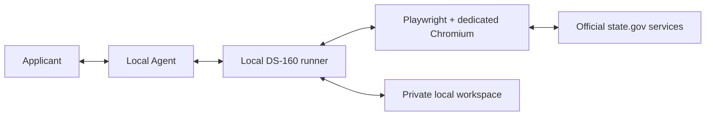

# DS-160 B1/B2 Autofill Skill

**English** | [简体中文](README.zh-CN.md)

A local Agent Skill for assisted DS-160 B1/B2 preparation and form filling.
Personal B1/B2 use is permanently free.

The Skill turns applicant material into a validated local profile, operates the
official CEAC website through a dedicated visible browser, and pauses for human input
at CAPTCHA, Review, correction, E-Sign, and submission boundaries. It is not an
immigration-advice service and is not affiliated with or endorsed by the U.S.
Department of State.

## Quick Start

Give this prompt to an Agent with local terminal and desktop-browser access:

```text
Please install or update the DS-160 B1/B2 Skill using its official guide:
https://gamhoi.github.io/ds160-autofill-releases/install.md

Use only the guide's public installer. Installation does not authorize filling,
electronic signing, or submission; ask me separately before each of those actions.
```

The Agent installation protocol is at [install.md](install.md). The installer selects
the current stable version from `stable.json`, verifies the release archive and binary
identity, installs the pinned browser driver, and returns exact verification steps.

## See It Work

> **Demo animation reserved.** A privacy-safe walkthrough is being prepared showing
> Agent installation, local document intake, profile preparation, visible browser
> automation, human CAPTCHA entry, rapid form filling, Review, explicit submission
> authorization, and the downloaded confirmation document.

<!--
When the approved asset is ready, replace the callout above with a Markdown image
whose alt text is "DS-160 assisted filling demonstration" and whose source is
assets/demo.webp. Keep the asset synthetic and follow the private maintainer
storyboard/redaction spec.
-->

## How It Works



There is no project-operated applicant-data backend. Applicant files remain in the
user's local workspace; values and photos are transmitted only when filling the
official CEAC and `state.gov` photo-service pages. Installation separately contacts
GitHub and may contact npm and the Playwright browser distribution service.

[Read the architecture and data-flow details](docs/architecture.md).

## Expected Workflow

1. Install and verify the Skill, driver, and dedicated browser.
2. Provide applicant documents and answer unresolved factual questions.
3. Generate and validate a local profile before opening CEAC.
4. Let the runner fill the form while the Agent reports progress and checkpoints.
5. Review every section against the source material and apply corrections locally.
6. Sign or submit only after a new, explicit authorization from the applicant.

CAPTCHAs are read by the applicant. The tool does not silently sign or submit an
application.

## Supported Systems

| Platform | Architecture |
| --- | --- |
| Windows | x64 |
| macOS | Intel x64 |
| macOS | Apple Silicon ARM64 |

Node.js 20 or newer and npm are installation dependencies. The installed runtime is a
platform executable; Playwright and Chrome for Testing are installed separately and
pinned to the supported version.

## Trust, Privacy, and Limitations

- The installer is public and source-readable.
- Release archives have a fixed file allowlist, SHA-256 checksums, and embedded
  version/build identity checks.
- The runtime does not use a developer account, analytics endpoint, telemetry
  collector, licensing server, or applicant-data backend.
- The current Windows and macOS executables are distributed without paid platform
  code-signing certificates. Checksums verify integrity, not publisher identity.
- The applicant remains responsible for the accuracy of all answers and for the final
  decision to sign and submit.

Read the [security model](docs/security.md), [privacy statement](docs/privacy.md), and
[personal-use license](LICENSE.txt) before installation.

## Documentation

| Topic | Document |
| --- | --- |
| Install or update | [Agent installation protocol](install.md) |
| Architecture and local data flow | [Architecture](docs/architecture.md) |
| Trust boundaries and unsigned binaries | [Security](docs/security.md) |
| Applicant-data handling | [Privacy](docs/privacy.md) |
| Installation failures | [Troubleshooting](docs/troubleshooting.md) |
| Update, rollback, and uninstall | [Maintenance](docs/maintenance.md) |
| Maintainer-directed candidates | [Release testing](docs/release-testing.md) |

Platform packages and immutable manifests are published under
[GitHub Releases](https://github.com/gamhoi/ds160-autofill-releases/releases). For
questions, compatibility reports, or feature requests, open an issue in this
repository. Do not attach applicant profiles, photos, CAPTCHA images, logs containing
answers, or downloaded application documents.
