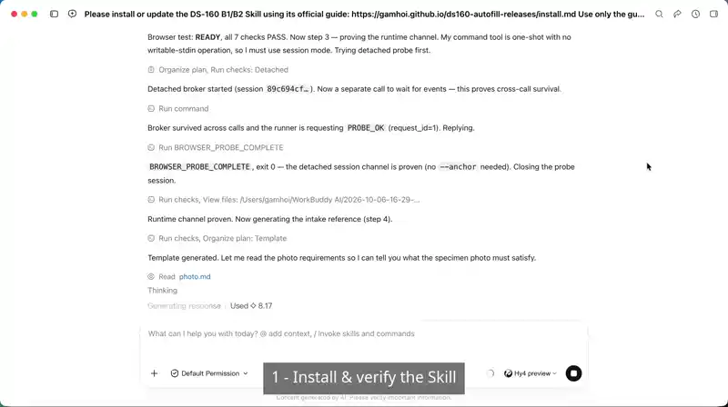
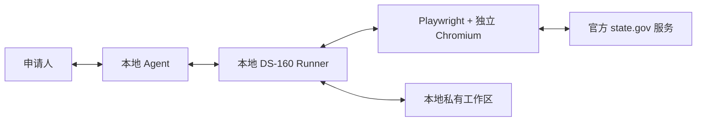

# DS-160 B1/B2 自动填写 Skill

[English](README.md) | **简体中文**

这是一个在本地运行的 Agent Skill，用于协助准备和填写 DS-160 B1/B2 申请表。
个人 B1/B2 用途永久免费。

Skill 会把申请材料整理成经过校验的本地 profile，通过独立且可见的浏览器操作
美国国务院官方 CEAC 网站，并在验证码、Review、更正、电子签名和提交等环节暂停，
交由申请人确认。它不提供移民法律建议，也不隶属于或代表美国国务院。

## 快速开始

把下面这段话发送给拥有本地终端和桌面浏览器权限的 Agent：

```text
请按照 DS-160 B1/B2 Skill 的官方指南安装或更新：
https://gamhoi.github.io/ds160-autofill-releases/install.md

只使用指南提供的公开安装器。安装不代表我授权填写、电子签名或提交；
执行这些操作前，请分别向我确认并取得授权。
```

Agent 安装协议位于 [install.md](install.md)。安装器会读取 `stable.json` 选择当前稳定
版本，校验发布压缩包和二进制身份，安装固定版本的浏览器驱动，并返回准确的验证步骤。

## 使用演示



演示中的申请人资料全部为虚构数据。动图展示 Agent 安装、本地 profile 准备、可见的
独立浏览器、人工输入验证码、快速填写、更正重放、Review、独立的提交授权以及下载
确认文件。

## 工作原理



项目不运行用于接收申请人资料的后台服务。申请文件保留在用户本地工作区；只有在填写
美国国务院官方 CEAC 和 `state.gov` 照片服务页面时，相关字段值和照片才会发送给官方
网站。安装过程中会另外访问 GitHub，也可能访问 npm 和 Playwright 浏览器分发服务。

[查看架构和数据流说明](docs/architecture.md)。

## 标准流程

1. 安装并验证 Skill、浏览器驱动和独立浏览器。
2. 提供申请材料，并回答材料中无法确定的事实问题。
3. 在打开 CEAC 前生成并校验本地 profile。
4. Runner 自动填写表格，Agent 持续报告进度和人工检查点。
5. 对照原始材料逐段检查 Review，并在本地完成必要更正。
6. 只有申请人再次明确授权后，才可以电子签名或提交。

验证码由申请人识别。工具不会静默签名或提交申请。

## 支持的平台

| 平台 | 架构 |
| --- | --- |
| Windows | x64 |
| macOS | Intel x64 |
| macOS | Apple Silicon ARM64 |

安装依赖 Node.js 20 或更高版本以及 npm。安装后的 Runtime 是对应平台的可执行文件；
Playwright 和 Chrome for Testing 会独立安装，并固定到受支持的版本。

## 信任、隐私与限制

- 安装器公开且可以直接阅读源码。
- 发布压缩包使用固定文件白名单、SHA-256 校验和以及嵌入式版本和 build 身份校验。
- Runtime 不使用开发者账号、分析接口、遥测收集器、授权服务器或申请人资料后台。
- macOS 可执行文件使用不包含发布者身份的 ad-hoc 签名，没有维护者 Developer ID 或
  Apple 公证；Windows 可执行文件没有 Authenticode 发布者签名。校验和能够验证完整性，
  但不能证明发布者身份。
- 申请人始终需要自行负责所有回答的准确性，以及是否最终签名和提交。

安装前请阅读[安全模型](docs/security.md)、[隐私说明](docs/privacy.md)和
[个人使用许可](LICENSE.txt)。

## 文档

| 主题 | 文档 |
| --- | --- |
| 安装或更新 | [Agent 安装协议](install.md) |
| 架构和本地数据流 | [Architecture](docs/architecture.md) |
| 信任边界和发布者身份 | [Security](docs/security.md) |
| 申请人资料处理 | [Privacy](docs/privacy.md) |
| 安装故障 | [Troubleshooting](docs/troubleshooting.md) |
| 更新、回滚与卸载 | [Maintenance](docs/maintenance.md) |
| 维护者指定的候选版本 | [Release testing](docs/release-testing.md) |

各平台安装包和不可变 manifest 发布在
[GitHub Releases](https://github.com/gamhoi/ds160-autofill-releases/releases)。如有问题、
兼容性报告或功能建议，请在本仓库提交 Issue。不要在 Issue 中附加申请人 profile、照片、
验证码图片、包含答案的日志或下载的申请文件。
